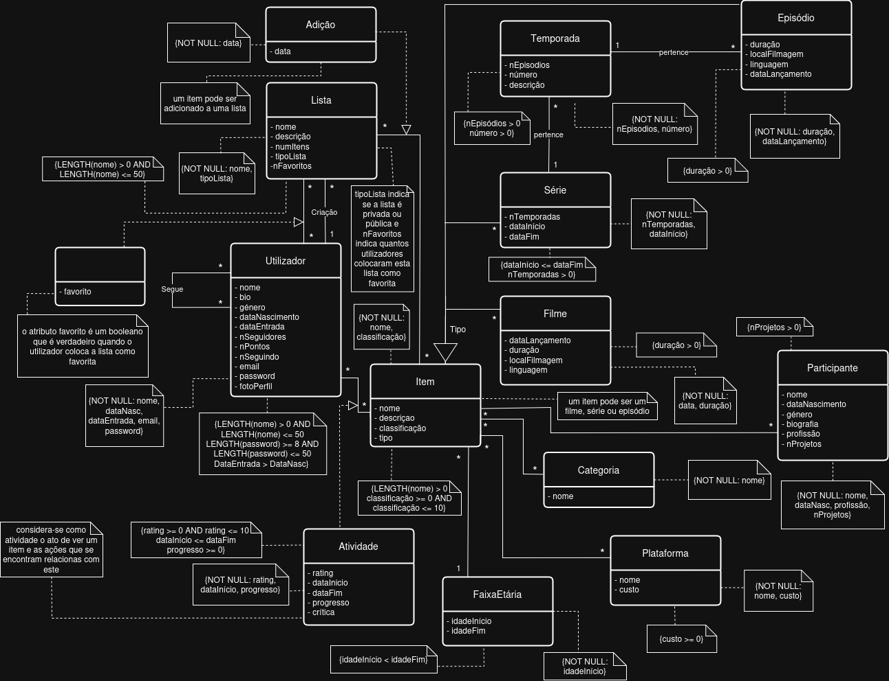

# Cinema DB

A lightweight and relational database architecture inspired by IMDb, designed to store and manage extensive data on movies, television series, and actors. In addition to media tracking, the system features social media capabilities, fully supporting user profiles, social follows, and content engagement metrics (likes and reviews).

> **Academic Context:** This project was developed in an academic environment at the Faculty of Engineering of the University of Porto (FEUP) for the Database course. Developed in a team of three members.

---

## 🛠️ Tech Stack

* **Database Engine:** SQLite
* **Design & Modeling:** Draw.io (UML and Relational Diagrams)

---

## 👥 My Contributions & Features Developed

While this was a collaborative 3-member project, the tasks were strategically divided. My engineering focus and primary responsibilities included:

* **Schema Idealization & UML Modeling:** Collaborated on the initial architecture, entity-relationship brainstorming, and core UML layout. This laid the structural foundation that allowed the team to successfully parallelize subsequent development.
* **Schema Translation to SQLite:** Successfully translated abstract UML conceptual designs into concrete, optimized SQLite physical schemas. This included defining data types, establishing primary/foreign key constraints, and ensuring data integrity across all intersecting social and media entities.

---

## 📐 Database Design

The project architecture focuses on two main ecosystems:
1.  **Media Engine:** Handles core entities like Movies, Series, Seasons, Episodes, Actors, and Directors, mapped out to handle complex casting and production relationships.
2.  **Social Engine:** Implements relational networks enabling Users to follow other users, write reviews, and "like" specific media assets.

## 🚀 Getting Started

To learn how to quickly set up, seed, run testing queries, or interactively inspect the relational tables on your local machine using SQLite, please follow our detailed guide: 
👉 **[View Installation & Execution Instructions](./INSTRUCTIONS.md)**